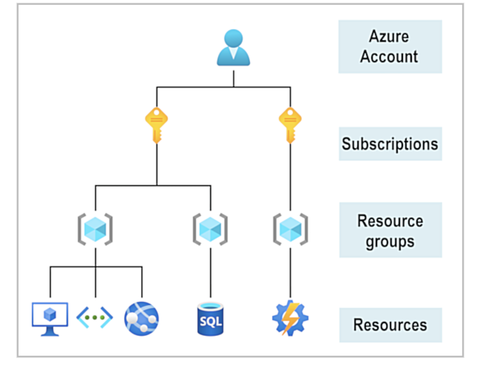
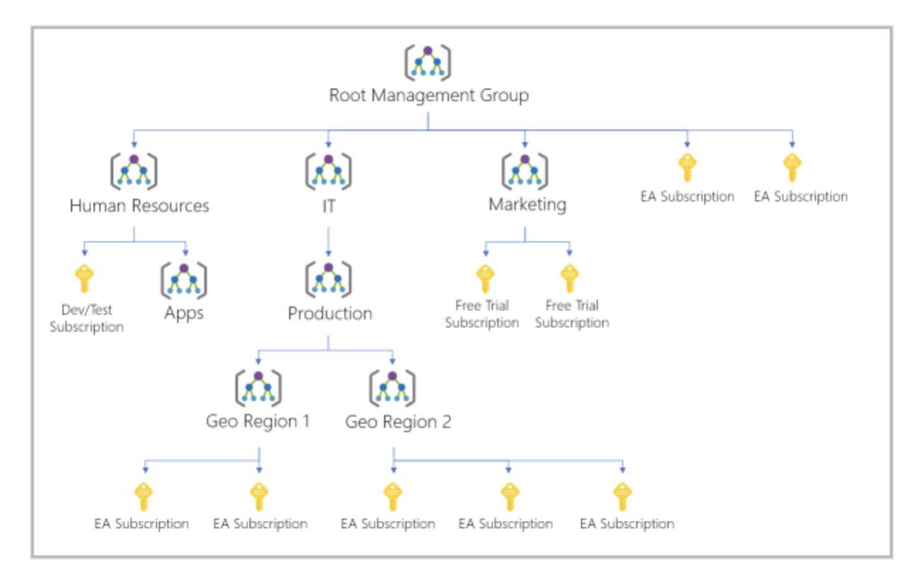
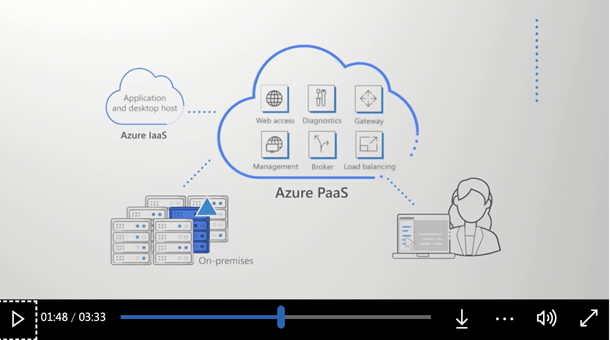

# Microsoft_azure
Microsoft Certified: Azure Fundamentals

## Concepts 
1. storage
2. cloud computing (Iaas ,Paas ,Saas)
3. networking
4. tools:admin,govern

## Study guide for Exam AZ-900: Microsoft Azure Fundamentals
### https://learn.microsoft.com/en-gb/credentials/certifications/resources/study-guides/az-900
- Describe cloud concepts (25–30%)
- Describe Azure architecture and services (35–40%)
- Describe Azure management and governance (30–35%)

 ## 1. Describe cloud concepts
### Unit -1 module 1
Azure Fundamentals includes interactive exercises that give you hands-on experience with Azure. Many exercises provide a temporary Azure portal environment called the sandbox
a. Define cloud computing.
b. Describe the shared responsibility model.
c. Define cloud models, including public, private, and hybrid.
- Identify appropriate use cases for each cloud model.
- Describe the consumption-based model.
d. Compare cloud pricing models.

a. cloud computing is where the PC is in the cloud center insted of physically with us , we only pay for the services used .
- all the cloud provider mainly provide ( compute power and storage)
- compute power : is how much processeing a computer can do and which allows for latest upadte and processing quick
- storage : PC/traditional  has limited hard drive space and cloud make sure its up to date and its backedup

b. shared responsibility model , in traditional computers there where datacenter which was taken care of and if the cilent wanted any details they had to rely on the employee working in datacenter

- Then, for some things, the responsibility depends on the situation. If you’re using a cloud SQL database, the cloud provider would be responsible for maintaining the actual database. However, you’re still responsible for the data that gets ingested into the database. If you deployed a virtual machine and installed an SQL database on it, you’d be responsible for database patches and updates, as well as maintaining the data and information stored in the database.
- as the datacenter has shifted to cloud they have three diffrent models IAAS , PAAS ,SAAS.
- IaaS places the most responsibility on the consumer, with the cloud provider being responsible for the basics of physical security, power, and connectivity. On the other end of the spectrum
-  SaaS places most of the responsibility with the cloud provider. PaaS, being a middle ground between IaaS and SaaS
-  Saas-Paas-Iaas
-  You’ll always be responsible for:
The information and data stored in the cloud
,Devices that are allowed to connect to your cloud (cell phones, computers, and so on)
,The accounts and identities of the people, services, and devices within your organization

- The cloud provider is always responsible for:
The physical datacenter
,The physical network
,The physical hosts
- Your service model will determine responsibility for things like:

Operating systems
,Network controls
,Applications
,Identity and infrastructure

c. What are cloud models? The cloud models define the deployment type of cloud resources. The three main cloud models are: private, public, and hybrid.
- It companies use the private which comes with great value and which have datacenters ( in private there are 2 types on permis and host services by 3rd party)
- thirdparty service given by the aws or azure for public cloud
- Hybrid clouds rely on secure network connections, often using technologies like virtual private networks (VPNs)
- **Azure Arc** is a set of technologies that helps manage your cloud environment. Azure Arc can help manage your cloud environment, whether it's a public cloud solely on Azure, a private cloud in your datacenter, a hybrid configuration, or even a multi-cloud environment running on multiple cloud providers at once.
- What if you’re already established with VMware in a private cloud environment but want to migrate to a public or hybrid cloud? Azure VMware Solution lets you run your **VMware** **workloads** in Azure with seamless integration and scalability.
- Azure VMware Solution (AVS) is a cloud service offered by Microsoft Azure in collaboration with VMware. It enables organizations to run their   VMware workloads natively within the Microsoft Azure cloud environment.

d.Capital expenditure (CapEx) and operational expenditure (OpEx).

- CapEx is typically a one-time, up-front expenditure to purchase or secure tangible resources. A new building, repaving the parking lot, building a datacenter, or buying a company vehicle are examples of CapEx.

- In contrast, OpEx is spending money on services or products over time. Renting a convention center, leasing a company vehicle, or signing up for cloud services are all examples of OpEx.

### module 2
- Describe the benefits of using cloud services
  a.Describe the benefits of high availability and scalability in the cloud.
  b.Describe the benefits of reliability and predictability in the cloud.
  c.Describe the benefits of security and governance in the cloud.
  d.Describe the benefits of manageability in the cloud.

 - You’ll also learn about security, governance, and overall manageability in the cloud.
 - **SLA (Service level agreement)** , which is agreement between the company and IT services to give UP time services from 90% to 99.9% avaiblibe to customers from the cloud provider.
 - Scaling generally comes in two varieties: vertical and horizontal. Vertical scaling is focused on increasing or decreasing the capabilities of resources. Horizontal scaling is adding or subtracting the number of resources.
 - **cost:**You can even use tools like the Total Cost of Ownership (TCO) or Pricing Calculator to get an estimate of potential cloud spend.
 - **Predictability** in the cloud lets you move forward with confidence. Predictability can be focused on performance predictability or cost predictability. Both performance and cost predictability are heavily influenced by the Microsoft Azure Well-Architected Framework.
 - The cloud, by virtue of its decentralized design, naturally supports a reliable and **resilient** infrastructure. With a decentralized design, the cloud enables you to have resources deployed in regions around the world. With this global scale, even if one region has a catastrophic event other regions are still up and running.
 - And because the cloud is intended as an over-the-internet delivery of IT resources, cloud providers are typically well suited to handle things like distributed denial of service (DDoS) attacks, making your network more robust and secure.

- Management in the cloud
- Management in the cloud speaks to how you’re able to manage your cloud environment and resources. You can manage these:

- Through a web portal
a.Using a command line interface.
b.Using APIs.
c.Using PowerShell.

### module 3

- In this module, you’ll be introduced to cloud service types. You’ll learn how each cloud service type determines the flexibility you’ll have with managing and configuring resources.
  
 a.Describe infrastructure as a service (IaaS).
b.Describe platform as a service (PaaS).
c.Describe software as a service (SaaS).
d.Identify appropriate use cases for each cloud service (IaaS, PaaS, SaaS).

a. 1.**Lift-and-Shift Migration:** When you want to transition your existing on-premises infrastructure and applications to the cloud without significant redevelopment. IaaS allows you to replicate your current environment in the cloud, providing familiarity and easier migration.

2.**Testing and Development:** IaaS is excellent for creating development and testing environments that can be rapidly provisioned or de-provisioned. This agility is beneficial for developers who need consistent and controlled testing environments.

b. In both cases, IaaS offers the flexibility of cloud computing while retaining control over the underlying infrastructure, making it a valuable choice for many organizations.

n the PaaS model, the cloud provider will also maintain the operating systems, databases, and development tools. Think of PaaS like using a domain joined machine: IT maintains the device with regular updates, patches, and refreshes.

c. **Development Framework:** PaaS offers developers a platform with pre-built tools and components to create and customize cloud-based applications. It's akin to building on top of an existing framework, reducing the need for extensive coding. This approach leverages cloud features like scalability and high availability, making application development more efficient.

**Analytics and Business Intelligence:** PaaS provides tools and services for data analysis, mining, and business intelligence. Organizations can use these services to gain insights from their data, identify patterns, and make informed decisions. This is valuable for improving forecasting, product design, investments, and various other business choices.

PaaS simplifies development and data analysis processes, allowing organizations to focus on application functionality and data-driven decision-making rather than managing underlying infrastructure.

## 2. Microsoft Azure Fundamentals: Describe Azure architecture and services
### Module 1
- Describe Azure regions, region pairs, and sovereign regions.
- Describe Availability Zones.
- Describe Azure datacenters.
- Describe Azure resources and Resource Groups.
- Describe subscriptions.
- Describe management groups.
- Describe the hierarchy of resource groups, subscriptions, and management groups.
  
  - For example, your company might use a single Azure account for your business and separate subscriptions for development, marketing, and sales departments. After you've created an Azure su**bscription, you can start creating Azure resources within each subscription.
  - The https://azure.microsoft.com/en-gb/free/students/ **is an offer for students that gives $100 credit and free developer tools. Also, you can sign up without a credit card.
  ### ** LAB1**
  - **sandbox**: This temporary subscription allows you to create Azure resources during a Learn module. Learn automatically cleans up the temporary resources for you after you've completed the module.

When you're completing a Learn module, you're welcome to use your personal subscription to complete the exercises in a module. However, the sandbox is the preferred method to use because it allows you to create and test Azure resources at no cost to you.
a. command line prompt 
1. azure cloud shell ( get-date) // use "pwsh " to move backfrom bash
2. bash (date)
3. intractive mode // useful if not familiar with bash and azure
  > **The core architectural components of Azure may be broken down into two main groupings: 1. the physical infrastructure, and 2. the management infrastructure.**

  - 1. Availability zones are primarily for VMs, managed disks, load balancers, and SQL databases. Azure services that support availability zones fall into three categories:

- Zonal services: You pin the resource to a specific zone (for example, VMs, managed disks, IP addresses).
Zone-redundant services: The platform replicates automatically across zones (for example, zone-redundant storage, SQL Database).
Non-regional services: Services are always available from Azure geographies and are resilient to zone-wide outages as well as region-wide outages.
- 2. The management infrastructure includes Azure resources and resource groups, subscriptions, and accounts. Understanding the hierarchical organization will help you plan your projects and products within Azure.
 
- 10,000 management groups can be supported in a single directory.
- A management group tree can support up to six levels of depth. This limit doesn't include the root level or the subscription level.
- Each management group and subscription can support only one parent.( they only have one root user, no two parents)

 ### Lab-2
  - Task 1: Create a virtual machine, In this task, you’ll create a virtual machine using the Azure portal.

a. Sign in to the Azure portal.

b.Select Create a resource > Compute > Virtual Machine > Create

c.The Create a virtual machine pane opens to the basics tab

d.Verify or enter the following values for each setting. If a setting isn’t specified, leave the default value

- Task 2: Verify resources created Once the deployment is created, you can verify that Azure created not only a VM, but all of the associated resources the VM needs

a.Select Home 
b.Select Resource groups

## 2.Describe Azure compute and networking services
### Module 2
- Compare compute types, including container instances, virtual machines, and functions
- Describe virtual machine (VM) options, including VMs, Virtual Machine Scale Sets, availability sets, Azure Virtual Desktop
- Describe resources required for virtual machines
- Describe application hosting options, including Azure Web Apps, containers, and virtual machines
- Describe virtual networking, including the purpose of Azure Virtual Networks, Azure virtual subnets, peering, Azure DNS, VPN Gateway, and ExpressRoute
- Define public and private endpoints
  #### Azure virtual desktop
 
 - Containers are a virtualization environment. Much like running multiple virtual machines on a single physical host, you can run multiple containers on a single physical or virtual host.
 - containers virtualise the OS
 - VM virtualise the hardware
 - One of the most popular container engines is Docker, and Azure supports **Docker**.
 - Azure Container Instances are a platform as a service (PaaS) offering. Azure Container Instances allow you to upload your containers and then the service will run the containers for you.
 - Container Apps have extra benefits such as the ability to incorporate load balancing and scaling.
 - Azure Kubernetes Service (AKS) is a container orchestration service. An orchestration service manages the lifecycle of containers.
 - This architecture is where you break solutions into smaller, independent pieces. For example, you might split a website into a container hosting your front end, another hosting your back end, and a third for storage. 
 - Imagine your website back-end has reached capacity but the front end and storage aren't being stressed. With containers, you could scale the back end separately to improve performance
#### Lab-3 Create a Linux virtual machine and install Nginx
- Nginx is a web server which is used to listen from a diffrent pages of a application each page as  route of a domain of a application and listen to the cloud provider
- we host a domain called www.nidhtravel.com and tis is loaded on to the cloud platform like azure and which will be listing though a port 80 or so and web hosting like Http page 

#### Azure functions
- f you build an app using VMs or containers, those resources have to be “running” in order for your app to function. With Azure Functions, an event wakes the function, alleviating the need to keep resources provisioned when there are no events.
- serlverless computing where the responsibly is taken care and not to worry and force on building apps
- functions helps in helping run the code and rest will be taken care
#### application hosting 
  - App Service enables you to build and host web apps, background jobs, mobile back-ends, and RESTful APIs in the programming language of your choice without managing infrastructure. It offers automatic scaling and high availability. App Service supports Windows and Linux.
#### azure networking 
- Azure virtual networks and virtual subnets enable Azure resources, such as VMs, web apps, and databases, to communicate with each other, with users on the internet, and with your on-premises client computers. You can think of an Azure network as an extension of your on-premises network with resources that link other Azure resources.
- Azure virtual network allows you to create multiple isolated virtual networks. When you set up a virtual network, you define a private IP address space by using either public or private IP address ranges. The IP range only exists within the virtual network and isn't internet routable. You can divide that IP address space into subnets and allocate part of the defined address space to each named subnet.
- Azure virtual networks enable you to link resources together in your on-premises environment and within your Azure subscription. In effect, you can create a network that spans both your local and cloud environments. There are three mechanisms for you to achieve this connectivity:

- a. Point-to-site virtual private network connections are from a computer outside your organization back into your corporate network. In this case, the client computer initiates an encrypted VPN connection to connect to the Azure virtual network.
- b. Site-to-site virtual private networks link your on-premises VPN device or gateway to the Azure VPN gateway in a virtual network. In effect, the devices in Azure can appear as being on the local network. The connection is encrypted and works over the internet.
- c. Azure ExpressRoute provides a dedicated private connectivity to Azure that doesn't travel over the internet. ExpressRoute is useful for environments where you need greater bandwidth and even higher levels of security.
- network traffic : By default, Azure routes traffic between subnets on any connected virtual networks, on-premises networks, and the internet. You also can control routing and override those settings, as follows:
- a. Network security groups are Azure resources that can contain multiple inbound and outbound security rules. You can define these rules to allow or block traffic, based on factors such as source and destination IP address, port, and protocol.
- b.Network virtual appliances are specialized VMs that can be compared to a hardened network appliance. A network virtual appliance carries out a particular network function, such as running a firewall or performing wide area network (WAN) optimization.
- You can link virtual networks together by using virtual network peering. Peering allows two virtual networks to connect directly to each other.Peering enables resources in each virtual network to communicate with each other. These virtual networks can be in separate regions, which allows you to create a global interconnected network through Azure.

### Lab-4 **Configure network access**
- create VM and install web server : Nginx 
- Run the following az vm list-ip-addresses command to get your VM's IP address and store the result as a Bash variable:
-Run the following az network nsg list command to list the network security groups that are associated with your VM:

### VPN
- A virtual private network (VPN) uses an encrypted tunnel within another network.
- VPNs can enable networks to safely and securely share sensitive information.
- VPN gateways a. Connect on-premises datacenters to virtual networks through a site-to-site connection.
b. Connect individual devices to virtual networks through a point-to-site connection.
c. Connect virtual networks to other virtual networks through a network-to-network connection.
- High-availability scenarios
> If you’re configuring a VPN to keep your information safe, you also want to be sure that it’s a highly available and fault tolerant VPN configuration. There are a few ways to maximize the resiliency of your VPN gateway.
> Active/standby
> Active/active
> ExpressRoute failover
> Zone-redundant gateways

